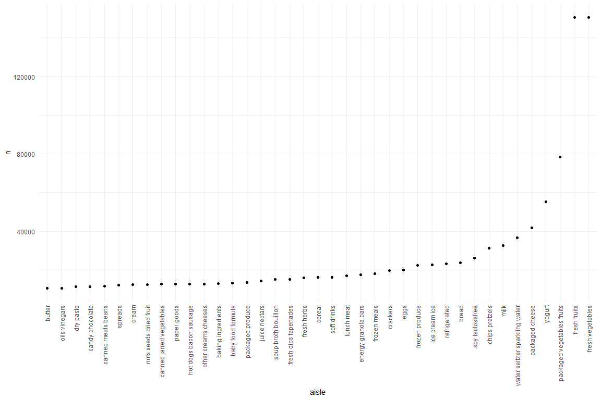
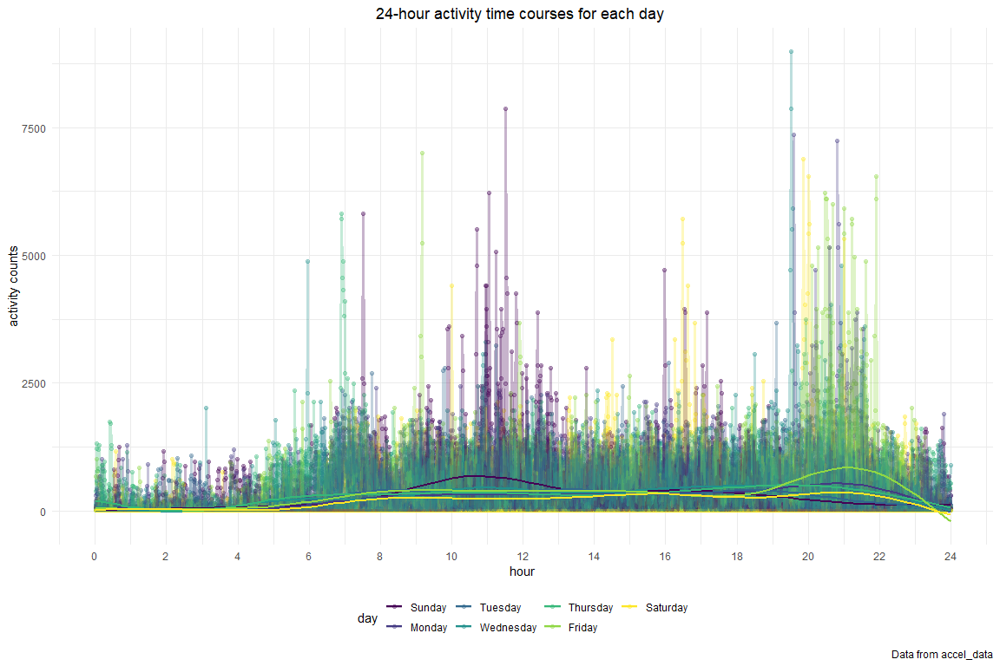

Homework 3 solutions
================
Zhourong Li zl2977
2020/10/10

### Due date

Due: October 10 at 10:00pm.

### Points

| Problem         | Points    |
| :-------------- | :-------- |
| Problem 0       | 20        |
| Problem 1       | –         |
| Problem 2       | 40        |
| Problem 3       | 40        |
| Optional survey | No points |

### Problem 0

This “problem” focuses on structure of your submission, especially the
use git and GitHub for reproducibility, R Projects to organize your
work, R Markdown to write reproducible reports, relative paths to load
data from local files, and reasonable naming structures for your files.

### Problem 1

``` r
data("instacart")
```

This dataset contains 1384617 rows and 15 columns.

Observations are the level of items in orders by user. There are user /
order variables – user ID, order ID, order day, and order hour. There
are also item variables – name, aisle, department, and some numeric
codes.

How many aisles, and which are most items from?

``` r
instacart %>% 
    count(aisle) %>% 
    arrange(desc(n))
```

    ## # A tibble: 134 x 2
    ##    aisle                              n
    ##    <chr>                          <int>
    ##  1 fresh vegetables              150609
    ##  2 fresh fruits                  150473
    ##  3 packaged vegetables fruits     78493
    ##  4 yogurt                         55240
    ##  5 packaged cheese                41699
    ##  6 water seltzer sparkling water  36617
    ##  7 milk                           32644
    ##  8 chips pretzels                 31269
    ##  9 soy lactosefree                26240
    ## 10 bread                          23635
    ## # ... with 124 more rows

Let’s make a plot

``` r
instacart %>% 
    count(aisle) %>% 
    filter(n > 10000) %>% 
    mutate(
        aisle = factor(aisle),
        aisle = fct_reorder(aisle, n)
    ) %>% 
    ggplot(aes(x = aisle, y = n)) + 
    geom_point() + 
    theme(axis.text.x = element_text(angle = 90, vjust = 0.5, hjust = 1))
```



Let’s make a table.

``` r
instacart %>% 
    filter(aisle %in% c("baking ingredients", "dog food care", "packaged vegetables fruits")) %>% 
    group_by(aisle) %>% 
    count(product_name) %>% 
    mutate(rank = min_rank(desc(n))) %>% 
    filter(rank < 4) %>% 
    arrange(aisle, rank) %>% 
    knitr::kable()
```

| aisle                      | product\_name                                 |    n | rank |
| :------------------------- | :-------------------------------------------- | ---: | ---: |
| baking ingredients         | Light Brown Sugar                             |  499 |    1 |
| baking ingredients         | Pure Baking Soda                              |  387 |    2 |
| baking ingredients         | Cane Sugar                                    |  336 |    3 |
| dog food care              | Snack Sticks Chicken & Rice Recipe Dog Treats |   30 |    1 |
| dog food care              | Organix Chicken & Brown Rice Recipe           |   28 |    2 |
| dog food care              | Small Dog Biscuits                            |   26 |    3 |
| packaged vegetables fruits | Organic Baby Spinach                          | 9784 |    1 |
| packaged vegetables fruits | Organic Raspberries                           | 5546 |    2 |
| packaged vegetables fruits | Organic Blueberries                           | 4966 |    3 |

Apples vs ice cream..

``` r
instacart %>% 
    filter(product_name %in% c("Pink Lady Apples", "Coffee Ice Cream")) %>% 
    group_by(product_name, order_dow) %>% 
    summarize(mean_hour = mean(order_hour_of_day)) %>% 
    pivot_wider(
        names_from = order_dow,
        values_from = mean_hour
    )
```

    ## `summarise()` regrouping output by 'product_name' (override with `.groups` argument)

    ## # A tibble: 2 x 8
    ## # Groups:   product_name [2]
    ##   product_name       `0`   `1`   `2`   `3`   `4`   `5`   `6`
    ##   <chr>            <dbl> <dbl> <dbl> <dbl> <dbl> <dbl> <dbl>
    ## 1 Coffee Ice Cream  13.8  14.3  15.4  15.3  15.2  12.3  13.8
    ## 2 Pink Lady Apples  13.4  11.4  11.7  14.2  11.6  12.8  11.9

### Problem2

The following code imported the data from the csv file, tidied the
dataset and converted the dataset from wide to long. The following code
also changed the type of `minute` from character to numeric, converted
`day` to a factor.

``` r
accel_data=
 read_csv(
    "./data/accel_data.csv"
  )%>%
  janitor::clean_names()%>%
  pivot_longer(
    activity_1:activity_1440,
    names_to="minute",
    names_prefix="activity_",
    values_to="activity_counts"
  )%>%
  mutate(
    minute=as.numeric(minute),
    day=factor(day),
    day=fct_relevel(day,"Sunday","Monday","Tuesday","Wednesday","Thursday","Friday","Saturday"),
    weekday_or_weekend=ifelse(day %in% c("Saturday","Sunday"),"weekend","weekday")
  )%>%
  arrange(week,day)
```

After tidying the dataset, our original dataset has the size of (50400,
6) , which contains 50400 observations of 6 variables, each row records
the information of that single minute in the five weeks. The variables
include *week*, *day\_id*, *day*, *minute*, *activity\_counts* and
*weekday\_or\_weekend*. Key variables are *minute* and
*activity\_counts*. The data has been arranged by day of the the week
from Sunday to Saturday.

``` r
accel_data%>%
  group_by(day,week) %>%
  summarize(
    total_activity=sum(activity_counts)
  ) %>%
  pivot_wider(
    names_from = day,
    values_from=total_activity
  ) %>%
  knitr::kable(align = 'c')
```

    ## `summarise()` regrouping output by 'day' (override with `.groups` argument)

| week | Sunday |  Monday   | Tuesday  | Wednesday | Thursday |  Friday  | Saturday |
| :--: | :----: | :-------: | :------: | :-------: | :------: | :------: | :------: |
|  1   | 631105 | 78828.07  | 307094.2 |  340115   | 355923.6 | 480542.6 |  376254  |
|  2   | 422018 | 295431.00 | 423245.0 |  440962   | 474048.0 | 568839.0 |  607175  |
|  3   | 467052 | 685910.00 | 381507.0 |  468869   | 371230.0 | 467420.0 |  382928  |
|  4   | 260617 | 409450.00 | 319568.0 |  434460   | 340291.0 | 154049.0 |   1440   |
|  5   | 138421 | 389080.00 | 367824.0 |  445366   | 549658.0 | 620860.0 |   1440   |

There are no clear trends being shown in this table. The
`total_activity` of each day is fluctuated. There exist two unusually
small `total_activity` over two Saturdays in week 4 and 5. The count
1440 indicates the accelerometer records 1 activity during 1 minute,
might due to default setting or by mistake.

``` r
accel_data %>%
  mutate(hour=minute / 60)%>%
  ggplot(aes(x = hour, y = activity_counts, group = day_id, color = day)) + 
  scale_x_discrete(
    breaks = seq(60,1440,60))+
  geom_point(alpha = .3, size = 1.6) + 
  geom_line(alpha = .3, size = 1.4) +
  geom_smooth(aes(group = day), se = FALSE)+
  labs(title = "24-hour activity time courses for each day ",
       caption = "Data from accel_data",
       x = "hour",
       y = "activity counts")+  
  scale_x_continuous(breaks = seq(0,24,2), limits = c(0,24))+
  theme(plot.title = element_text(hjust = 0.5))
```

    ## Scale for 'x' is already present. Adding another scale for 'x', which will
    ## replace the existing scale.

    ## `geom_smooth()` using method = 'gam' and formula 'y ~ s(x, bs = "cs")'



Based on this graph, we can see the individual has relatively small
activity between midnight until 5am everyday, which probably due to
sleep. One peak in activity counts is in the middle of the day on
Sundays, this peak might be caused by going out for lunch at weekends.
Other peaks in activity counts are in between 7pm to 10pm on Friday and
Saturday, might due to the individual go out eat dinner or do some
exercises.

### Problem3

``` r
library(p8105.datasets)
data("ny_noaa")
```

The size of the dataset is (2595176, 7), there are 2595176 observations
of 7 variables, the variables include *id*, *prcp*, *snow*, *snwd*,
*tmax*, *tmin* and *date*. The types of variables include date, integer
and character. Each row of the dataset contains the information about
the weather in each station everyday. There are 145838 missing values
for `precipitation`, 381221 missing values for `snowfall`, 591786
missing values for `snow depth`, 1134358 missing values for `tmax`,
1134420 missing values for `tmin.`

``` r
noaa_data=ny_noaa %>%
  janitor::clean_names()%>%
  separate(date, into=c("year", "month", "day"), sep = "-")%>%
  mutate(tmax=as.numeric(tmax),
         tmin=as.numeric(tmin),
         prcp=prcp/10
         ) %>%
  mutate(tmax=tmax/10,
         tmin=tmin/10)
```

We changed units for maximum and minimum temperature from tenth of
degree C to degree C and precipitation, from tenth of mm to mm.

``` r
getmode <- function(v) {
   uniqv <- unique(v)
   uniqv[which.max(tabulate(match(v, uniqv)))]
}
getmode(noaa_data$snow)
```

    ## [1] 0

We find 0 is the most commonly observed value. This is probably due to
snow is not common in New York for most of time.

``` r
noaa_data %>%
  filter((month =="01"| month == "07") & !is.na(tmax)) %>%
  group_by(month, year, id)%>%
  summarize(average_temp=mean(tmax))%>%
  ggplot(aes(x = year, y = average_temp))+
  geom_boxplot()+
  facet_grid(.~month)+
  theme(axis.text.x=element_text(angle = 90, hjust =1),plot.title = element_text(hjust = 0.5)) +
  labs(
    title = "Average max temperature in January and in July in each station across years",
    x="Year",
    y="Average temperature"
  )
```

    ## `summarise()` regrouping output by 'month', 'year' (override with `.groups` argument)


We can see the average max temperature of July is higher comparing with
January. There are some outliers in the plots, which indicate that there
existed some abnormally high and low temperatures in January, and there
also existed some abnormally low temperatures in July.

``` r
first_plot=
  noaa_data %>%
  filter(!is.na(tmax) & !is.na(tmin)) %>%
  ggplot(aes(x=tmax, y=tmin))+
  geom_hex()+
  labs(
    title = "tmax vs tmin for the full dataset",
    x="tmax",
    y="tmin")+
  theme(plot.title = element_text(hjust = 0.5),legend.position = "bottom", legend.key.width = unit(1.2,"cm"))


second_plot=
  noaa_data %>%
  filter(snow>0 & snow<100)%>%
  ggplot(aes(x=snow, color=year)) +
  geom_density(alpha = .5, adjust =.6)+
  labs(
    title = "Distribution of snowfall values",
    x = "Snowfall values",
    y = "Density") +
    theme(plot.title = element_text(hjust = 0.5), legend.position = "bottom", legend.key.width = unit(0.2, "cm"))

  
first_plot+second_plot   
```


From the hex plot, we found the largest counts are in area covered by
(-15,30) of tmin and (-10, 40) of tmax. In the distribution of snowfall
values, we observed that the most snowfall appears is 25mm while the
least is 100mm. Although there are fluctuations, the trend is mainly
decreasing from 0mm to 100mm. In the 0-15 mm range, there are
significant differences of snowfall values between years.
